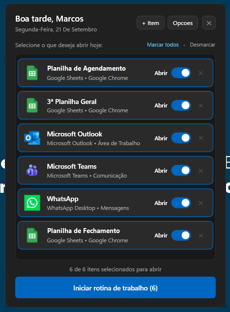
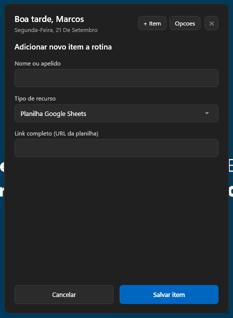

# Painel de Automação Desktop

Aplicação desktop em PowerShell e interface WPF para inicialização em lote de rotinas de trabalho no Windows.

## Demonstração

| Painel Principal (Rotina) | Adicionar Novo Recurso |
| :---: | :---: |
|  |  |

---

## Sobre o projeto

Criei este painel para automatizar o início do meu próprio expediente de trabalho no computador, reunindo em uma única interface a abertura ordenada de ferramentas diárias (planilhas do Google Sheets, Microsoft Outlook, Teams, WhatsApp e pastas locais). Como utiliza os recursos nativos do Windows (PowerShell e WPF), a ferramenta roda diretamente sem necessidade de instalar interpretadores pesados como Node.js ou Python.

---

## Funcionalidades

- Inicialização sequencial de aplicativos, pastas e links com intervalo configurável para evitar travamentos
- Seleção individual de itens: controle para marcar ou desmarcar o que deseja abrir naquele dia
- Prevenção de duplicidade: checagem de instâncias antes de disparar novos processos
- Cadastro e exclusão de novos itens (links, planilhas, programas e pastas) diretamente pela interface
- Painel de preferências: personalização do nome do operador, mensagem de saudação e cores de destaque
- Modo silencioso (CLI): script auxiliar (`iniciar.ps1`) para execução sem interface via terminal ou Agendador de Tarefas do Windows

---

## Tecnologias

- Windows PowerShell (lógica de automação e controle de processos)
- WPF / XAML (interface gráfica nativa Fluent Design)
- JSON (`config.example.json` versionado como template; o `config.json` de produção fica isolado na máquina local)
- VBScript (script auxiliar para disparo em segundo plano sem janela preta de console)

---

## Requisitos

- Windows 10 ou Windows 11
- PowerShell 5.1 ou superior (já integrado ao Windows)
- Google Chrome (recomendado para links de planilhas)

---

## Como usar

1. Clone o repositório:
```bash
git clone https://github.com/marcoserculianipw/painel-de-automacao-desktop.git
cd painel-de-automacao-desktop
```

2. Crie o atalho na Área de Trabalho executando o arquivo:
```cmd
Criar_Atalho_Area_de_Trabalho.bat
```

3. Abra o atalho gerado, selecione os programas desejados e clique em **Iniciar rotina de trabalho**.

> [!NOTE]
> **Privacidade e Configurações:** Na primeira execução, o script cria automaticamente o seu arquivo local `config.json` a partir do modelo `config.example.json`. O `config.json` é ignorado no versionamento (`.gitignore`) para garantir que suas rotinas, links internos e preferências nunca sejam enviados ao repositório público.

---

## Estrutura de arquivos

```text
├── minipainel.ps1                   # Interface gráfica em WPF e execução dos disparos
├── config.example.json              # Modelo padrão de configuração (config.json é gerado localmente e ignorado no Git)
├── iniciar.ps1                      # Execução via linha de comando (modo headless)
├── iniciar_tudo.vbs                 # Inicialização sem janela de console visível
├── iniciar_tudo.bat                 # Script batch auxiliar de disparo
├── criar_atalho.ps1                 # Gerador do atalho na Área de Trabalho
├── Criar_Atalho_Area_de_Trabalho.bat # Script batch de execução rápida do gerador de atalho
├── LICENSE                          # Licença MIT
└── assets/                          # Logotipos oficiais e capturas de tela da interface
    ├── painel_principal.png
    ├── adicionar_item.png
    ├── sheets.png
    ├── outlook.png
    ├── teams.png
    ├── whatsapp.png
    └── chrome.png
```
